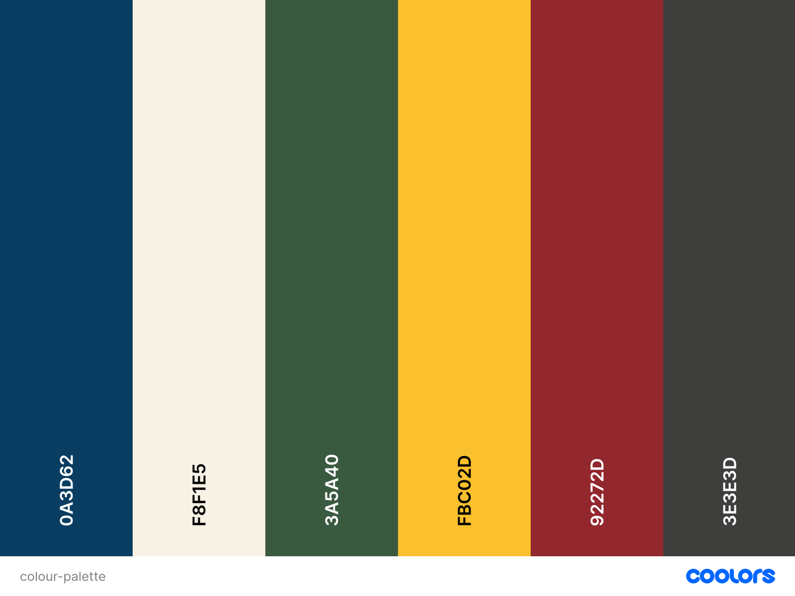
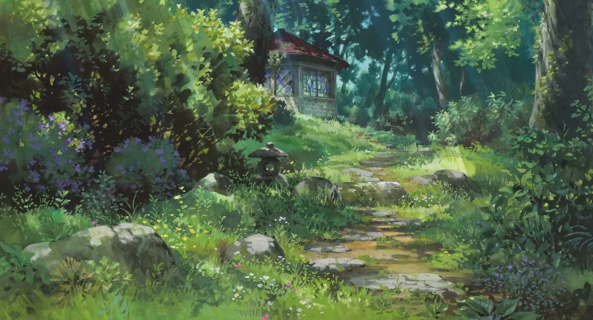

# [Studio Ghibli Quiz](#)

The Studio Ghibli Quiz Website is an interactive platform designed to test and expand your knowledge of Studio Ghibli films. Aimed at fans of the studio's iconic movies, this project offers a fun and engaging quiz experience with a variety of question types, including multiple-choice, true/false, and image-based questions.

Targeted towards both casual viewers and dedicated enthusiasts, the quiz provides an opportunity to deepen your appreciation for Studio Ghibli's enchanting worlds and memorable characters. Whether you're challenging yourself or simply enjoying the nostalgia, this website offers an entertaining way to connect with the magic of Studio Ghibli.

## Table of Contents

- [UX](#ux)
  - [Project Goals](#project-goals)
  - [User Stories](#user-stories)
  - [Design](#design)
  - [Wireframes](#wireframes)
- [Features](#features)
- [Feedback](#feedback)
- [Accessibility](#accessibility)
- [Manual Testing](#manual-testing)
  - [Features Testing](#features-testing)
  - [User Stories Testing](#user-stories-testing)
  - [Performance Issues and Solutions](#performance-issues-and-solutions)
  - [Browser Compatibility](#browser-compatibility)
  - [Responsiveness Testing](#responsiveness-testing)
  - [Code Validation](#code-validation)
  - [Bugs](#bugs)
  - [Lighthouse Testing](#lighthouse-testing)
- [Deployment](#deployment)
  - [Deployment (GitHub Pages)](#deployment-github-pages)
  - [Local Deployment](#local-deployment)
- [Technologies Used](#technologies-used)
  - [Languages](#languages)
  - [Design & Development Tools](#design--development-tools)
- [Credits](#credits)
  - [Code](#code)
  - [Research and Resources](#research-and-resources)
  - [Media](#media)
  - [Content](#content)

# UX

## Project Goals

- **Engage Users**: Create an interactive and enjoyable quiz experience that appeals to Studio Ghibli fans by offering a variety of challenging and fun questions.
- **Ensure Accessibility**: Design the website to be accessible and responsive, ensuring a seamless experience across all devices, including desktops, tablets, and smartphones.
- **Provide Immediate Feedback**: Implement a scoring system that provides instant feedback on answers, helping users learn and stay engaged throughout the quiz.
- **Maintain Thematic Consistency**: Use Studio Ghibli-inspired design elements, including imagery, colour schemes, and typography, to create a visually appealing and cohesive user experience.

## User Stories

- As a **Studio Ghibli Fan**, I want to test my knowledge of Studio Ghibli movies, so that I can see how well I know the films.

- As a **casual visitor**, I want the quiz to be easy to navigate and visually appealing so that I can enjoy the experience without any frustration.

- As a **mobile user**, I want to be able to take the quiz on my phone, so that I can enjoy it wherever I am.

- As a **trivia enthusiast**, I want to see a variety of question types (e.g., multiple-choice, true/false, image-based), so that the quiz stays interesting and challenging.

- As a **user with visual impairments**, I want the website to be accessible, so that I can participate in the quiz just like everyone else.

- As a **user who has completed the quiz**, I want to see my final score and have the option to retake the quiz, so that I can try to improve my score.

## Design

### Colour Palette

**#0A3D62 (Indigo Blue)**
**#F8F1E5 (Light Ivory)**
**#3A5A40 (Forest Green)**
**#FBC02D (Golden Yellow)**
**#92272D (Rusty Red)**
**#3E3E3D (Shadow Slate)**

### Typography

The quiz utilises **ITC Avant Garde Gothic**, the same font used in the Studio Ghibli logo, to maintain brand consistency and evoke the unique aesthetic of the studio:

- **Headings:** _ITC Avant Garde Gothic LT Medium_ is used for headings, providing a bold and clear emphasis on key sections.

- **Body Text:** _ITC Avant Garde Gothic LT Book_ is used for the main text, offering a clean and readable experience for users.

### Imagery

#### Logo and Favicon

For the website's branding, I have chosen a Totoro icon as both the logo and favicon. Totoro, one of the most beloved characters from Studio Ghibli's film My Neighbor Totoro, serves as a recognisable and charming symbol that immediately connects users with the magic of Studio Ghibli. The logo appears prominently in the top-left corner of each page, reinforcing the brand identity, while the favicon provides a small but effective visual cue in the browser tab, helping users easily identify the quiz among their open tabs.

#### Background

To further evoke the whimsical and natural aesthetics characteristic of Studio Ghibli films, the website features a background image of the garden from The Secret World of Arrietty. This lush, vibrant garden setting creates a visually captivating backdrop that complements the overall theme of the quiz. The background imagery not only enhances the visual appeal of the site but also immerses users in the world of Studio Ghibli, aligning with the fantastical and nature-centric elements of the films.

#### Image-Based Questions

The Studio Ghibli Quiz features two image-based questions to enhance user engagement and provide a more interactive experience. These questions incorporate high-quality images from Studio Ghibli films, challenging users to recognise and recall visual details. This approach not only makes the quiz more dynamic but also deepens users' connection to the films. The images are carefully chosen and optimised for various devices, and alternative text descriptions are provided to ensure accessibility for all users. Overall, these visual questions enrich the quiz experience by celebrating the distinctive artistry of Studio Ghibli.

## Wireframes

The following wireframes outline the basic layout and design of the key pages in the Studio Ghibli Quiz website. Each page follows a consistent structure, including a logo, navigation menu, and footer, to ensure a cohesive user experience.

- **Logo:** The Studio Ghibli Quiz logo will appear in the top-left corner of each page, providing consistent branding.
- **Navigation Menu:** Located at the top of each page, the navigation menu will include links to the Home, Quiz, Instructions, About, and Contact pages, allowing users to easily move between sections of the site.
- **Footer:** The footer will appear at the bottom of each page, potentially including copyright information, social media links, and any additional navigation links.

### Home Page

The home page serves as the entry point to the quiz. In the main content area, users are greeted with the title of the quiz prominently displayed at the top. Below the title, a welcoming message introduces the quiz and sets the tone for the experience. A large, easily identifiable button is placed centrally on the page, inviting users to start the quiz. This simple and clear design helps users understand the purpose of the site and encourages them to begin the quiz without any confusion.

### Quiz Page

The quiz page is where the interactive part of the experience takes place. The main content area is dedicated to presenting the current quiz question, which is displayed prominently at the top of the page. Below the question, users will find multiple-choice answers, presented as buttons or selectable options. This layout ensures that the focus remains on the question and answers, making it easy for users to engage with the quiz. At the bottom of the content area, a "Next" button allows users to proceed to the next question once they have made their selection.

### Instructions and About Pages

The Instructions and About pages share a similar layout, designed to provide users with essential information. In the main content area, the title of the page, such as "Instructions" or "About," is displayed at the top, followed by a block of text. On the Instructions page, this text guides users on how to play the quiz, while the About page offers background information about Studio Ghibli and the quiz itself. This consistent structure ensures that users can easily access and absorb the information they need.

### Contact Page

The Contact page is designed to facilitate communication between users and the quiz creators. The main content area includes a title at the top, followed by a brief piece of text inviting users to reach out with any questions or feedback. Below this text, a simple contact form is provided, which includes fields for the user’s name, email address, and a message. A submit button at the bottom of the form allows users to send their inquiries or comments directly from the page.

# Features

## Future Features

# Feedback

# Accessibility

# Manual Testing

## Features Testing

| Feature | Test case | Outcome |
| :-----: | :-------: | :-----: |
|         |           |         |

## User Stories Testing

## Performance Issues and Solutions

## Browser Compatibility

| Browser Tested | Intended Appearance | Intended Responsiveness |
| :------------: | :-----------------: | :---------------------: |
|     Chrome     |                     |                         |
|     Safari     |                     |                         |

## Responsiveness Testing

|    Device Tested    | Site responsive >= 700px | Site responsive < 699px> | Renders as expected |
| :-----------------: | :----------------------: | :----------------------: | :-----------------: |
|  iPhone 14 Pro Max  |                          |                          |                     |
| Samsung Galaxy S8 + |                          |                          |                     |
|      iPad Air       |                          |                          |                     |
|   MacBook Air 13"   |                          |                          |                     |
|     23" monitor     |                          |                          |                     |

## Code Validation

### HTML Validator

### CSS Validator

## Bugs

### Unfixed Bugs

## Lighthouse Testing

# Deployment

## Deployment (GitHub Pages)

This website was deployed using GitHub pages. Here are the steps of deployment:

1. Log in to GitHub and locate the [studio-ghibli-quiz](https://github.com/desireealexia/studio-ghibli-quiz) repository
2. Under the repository name, click **Settings**
3. In the "Code and automation" section on the left sidebar, click **Pages**
4. Under "Build and deployment", in the "Source" section, select _Deploy from a branch_
5. Use the branch dropdown menu to select _main_, ensuring that the _root_ folder is also selected
6. Save these settings
7. Under the repository name, click **Code**
8. Wait a few minutes and refresh the page
9. A "Deployments" section will appear on the right sidebar. Click the GitHub Pages link, which will open the deployed site
10. Click on the link to be taken to the live site

## Local Deployment

1. Log in to GitHub and locate the [studio-ghibli-quiz](https://github.com/desireealexia/studio-ghibli-quiz) repository
2. Click the green button that says **Code** and click **Local**
3. To clone the repository using HTTPS, copy the provided link
4. In your terminal, type `git clone` and then paste the link
5. Press Enter, and your local clone will be created

# Technologies Used

## Languages

**HTML5**

**CSS3**

**JavaScript (Vanilla JS)**

## Design & Development Tools

- Accessible Colour Palette Builder: This tool was essential in confirming that the chosen combinations met accessibility standards, particularly regarding text contrast.

- WebAIM Contrast Checker: Used to verify the contrast ratios between background and foreground colours, ensuring that the website's text is legible and meets accessibility guidelines.

- TinyPNG: Used to covert and compress all the images on the website.

- [Cloud Converter](https://cloudconvert.com/ttf-to-woff2): convert fonts from `.ttf` to `.woff` and `.woff2` files

# Credits

## Code

## Research and Resources

## Media

### Images

### Icons

## Content
